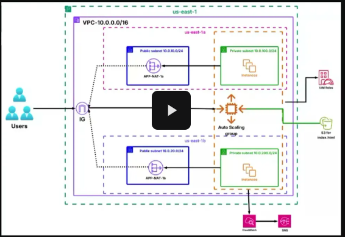

# 🚀 Scalable Web Application on AWS (EC2 + ALB + ASG)

## 📌 Project Overview
This project demonstrates the deployment of a **highly available and scalable web application** on AWS using:

- **EC2 Instances**
- **Application Load Balancer (ALB)**
- **Auto Scaling Groups (ASG)**
- **Amazon RDS** (optional for database)
- **Amazon S3** for static content
- **CloudWatch & SNS** for monitoring and alerts

The solution follows **AWS best practices** for scalability, fault tolerance, and cost optimization.

---

## 🏗️ Solution Architecture


**Flow:**
1. Users access the application through the **Application Load Balancer (ALB)**.
2. The ALB distributes traffic across multiple **EC2 instances** in an **Auto Scaling Group**.
3. **Auto Scaling** automatically adjusts capacity based on demand (CPU utilization or traffic).
4. **Amazon S3** stores static files such as `index.html` [Open index.html](src/index.html) .
5. **CloudWatch & SNS** monitor health and send alerts.
6. **IAM Roles** ensure secure access to AWS resources.

---

## 🔧 AWS Services Used
- **Amazon EC2** – Hosts the web application. 
- **Elastic Load Balancer (ALB/ELB)** – Distributes incoming traffic.  
- **Auto Scaling Group (ASG)** – Scales EC2 instances automatically.  
- **Amazon S3** – Stores static content.  
- **Amazon CloudWatch** – Monitors metrics and triggers alarms.  
- **Amazon SNS** – Sends notifications for alarms.  
- **IAM** – Manages secure access control.  

---

## ⚙️ EC2 User Data Script
The following **User Data** script automatically configures EC2 instances:

```bash
#!/bin/bash
apt update -y
apt install -y nginx
TOKEN=$(curl -X PUT "http://169.254.169.254/latest/api/token" -H "X-aws-ec2-metadata-token-ttl-seconds: 21600")
INSTANCE_ID=$(curl -H "X-aws-ec2-metadata-token: $TOKEN" -s http://169.254.169.254/latest/meta-data/instance-id)

HOSTNAME=$(hostname)

sudo apt install -y unzip curl
curl "https://awscli.amazonaws.com/awscli-exe-linux-x86_64.zip" -o "awscliv2.zip"
unzip awscliv2.zip
sudo ./aws/install

aws s3 cp s3://scalable-web-application-bucket/index.html /var/www/html/index.html --region us-east-1

systemctl enable nginx
systemctl restart nginx

WEB_FILE="/var/www/html/index.html"
echo "<script>" >> $WEB_FILE
echo "const HOSTNAME='$HOSTNAME';" >> $WEB_FILE
echo "const INSTANCE_ID='$INSTANCE_ID';" >> $WEB_FILE
echo "document.getElementById('hostname').innerText = HOSTNAME;" >> $WEB_FILE
echo "document.getElementById('instance-id').innerText = INSTANCE_ID;" >> $WEB_FILE
echo "</script>" >> $WEB_FILE
```

---

## 🔒 Security Considerations
- Instances are placed in private subnets according to the architecture.
- Security groups allow only necessary traffic (HTTP).
- S3 bucket policies restrict access.

---

## 📊 Monitoring & Alerts
- CloudWatch alarms monitor CPU utilization.
- SNS topics notify the administrator if thresholds are breached.

---

## 🚀 Deployment
1. Launch infrastructure using **AWS Console**.  
2. Deploy the web application to **EC2 instances**.  
3. Access the application via the **ALB DNS name**.

---

## 🎯 Learning Outcomes
- Deploy a secure and scalable EC2-based web application.  
- Configure ALB and ASG for high availability.  
- Use Auto Scaling policies to optimize cost and performance.  
- Implement monitoring and alerting with CloudWatch & SNS.

---

## 💡 Future Improvements
- Add an **RDS** database for dynamic content.  
- Use **CloudFront** for content delivery.  
- Enable Auto Scaling policies based on multiple metrics.

---

## 📂 Repository Structure
```
Scalable Web Application on AWS (EC2 + ALB + ASG)/
│── README.md
│── architecture-diagram.png
│── recorded-video.mp4
│── src/
    └── index.html
```

---

## 📹 Recorded Video
[▶️](recorded-video.mp4)

---

## 👨‍💻 Author
**Ahmed Daoud**  
AWS Cloud Practitioner | Aspiring Solutions Architect  

[](https://www.linkedin.com/in/ahmedmohameddaoud/)
[](https://ahmedmodaoud.github.io/)

